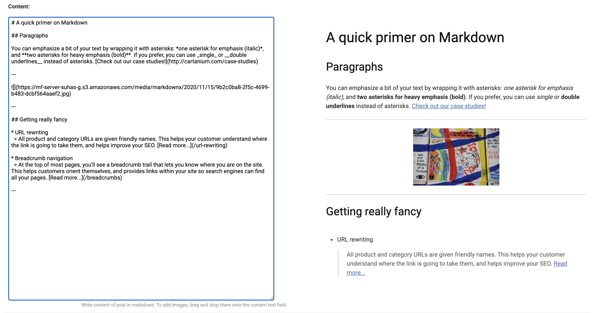
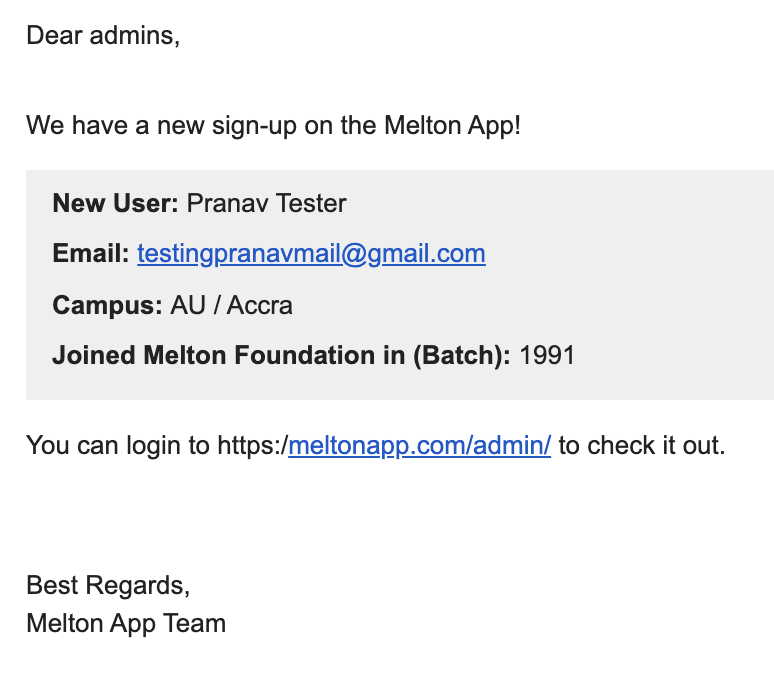

# Melton-App-Server
## Django backend for the Melton App - [meltonapp.com](https://meltonapp.com)
#### REST API, Django dashboard, markdown preview editor, Google and Apple oauth, simple online store, automated emails

If you're a Melton Fellow and you can think of cool use-cases for this Melton API (currently the Melton App is the only client) reach out to us!
You can see the API schema here: [meltonapp.com/api/docs](https://meltonapp.com/api/docs)

We would love your contributions - raise a new issue or have a look at the existing ones :)

## Features

### Markdown preview editor

### Melton REST API

### Django admin dashboard

### Automated emails on sign-up

More docs:
1. [Getting Started](docs/getting-started.md)
2. [Contributing](docs/contibuting.md)
