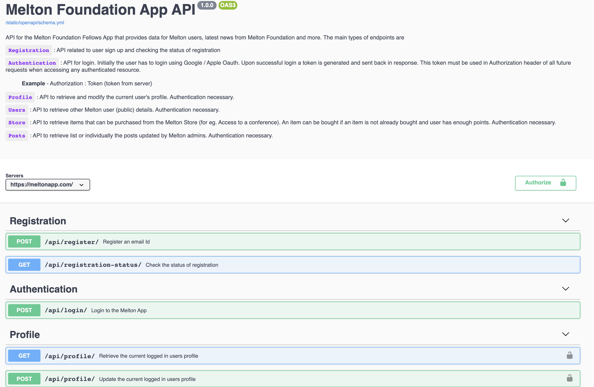
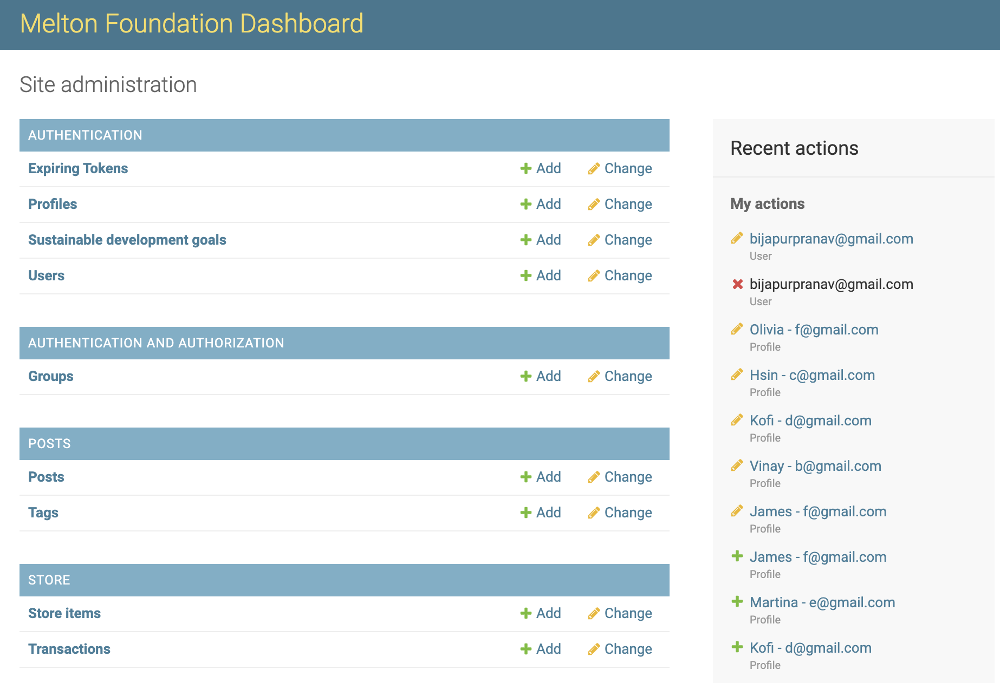

# Melton-App-Server

## Django backend for the Melton App - [meltonapp.com](https://meltonapp.com)
### REST API, Django dashboard, markdown preview editor, Google and Apple oauth, simple online store, automated emails

If you're a Melton Fellow and you can think of cool use-cases for this Melton API (currently the Melton App is the only client) reach out to us!
You can see the API schema here: [meltonapp.com/api/docs](https://meltonapp.com/api/docs)

Whether you're a Melton Fellow or not, we would love your contributions - raise a new issue or have a look at the existing ones :)

## Features

### Markdown preview editor

### Melton REST API

### Django admin dashboard

### Automated emails on sign-up

More docs:
1. [Getting Started](docs/getting-started.md) - how to setup your local env
2. [Contributing](docs/contibuting.md) - code conventions and general tips
