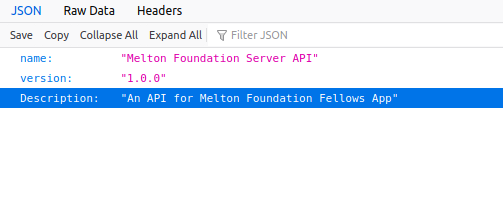

# Getting Started

1. Install pre-requisites for the project depending on your operating system. Ubuntu is recommended as this is tested on Ubuntu 18.04 LTS. Ideally it should work on all OS, as that is the purpose of Dockers, but if you face any issues do raise a Github issue.
   1. Docker 
      1. Linux - https://docs.docker.com/install/linux/docker-ce/ubuntu/
      2. Windows - https://docs.docker.com/docker-for-windows/install/
      3. MacOs - https://docs.docker.com/docker-for-mac/install/
   2. Docker compose - https://docs.docker.com/compose/install/
   3. Python 3
   4. Git
   5. Recommended IDE - VS code - but again doesn't really matter.
2. Fork and clone this repo - the usual stuff.
3. Even though this project is dockerised, its useful only for end to end testing and while deploying to Production. For local development it is still much faster to run django development server. So, I will divide the setup into Development and Docker section.   

### Development
1. After cloning the repo, change directory to [app](../app) folder.
2. Create a new Python3 virtual environment using venv (It's recommended for Python 3) named 'venv' (else change the vscode settings to point to proper environment name).   - https://docs.python.org/3/library/venv.html
3. Activate the virtual environment and install the required python libraries by running - `pip install -r requirements.txt`
4. Change current directory to [api](../app/api)
5. For any testing purpose, you can delete your sqlite3 db and run  `python manage.py makemigrations` and `python manage.py migrate` to apply all changes to DB Schema
6. To load some initial data - for eq. a super user, run `python manage.py authentication/fixtures/superuser.json` to load the data present in superuser.json file.
7. Now you can run `python manage.py runserver` to start the django application.
8. Open http://127.0.0.1:8000/api to view the application.

### Docker
1. Open the terminal in root folder of the application. And run `docker-compose up` or `sudo docker-compose up` depending on how docker is installed on your system. 
2. This will install all the required containers and start the application.
3. Open http://127.0.0.1:9000/api to view the application. (The difference in port is just because here the application goes through nginx first. This port can be changed in docker-compose.yml file)

The opened webpage looks as below if opened on Firefox

